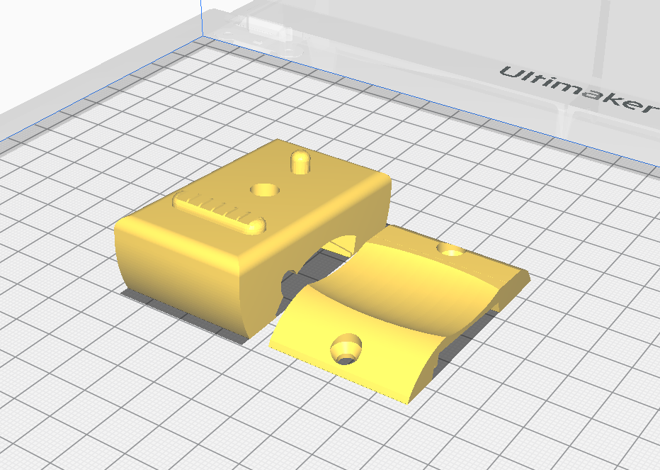
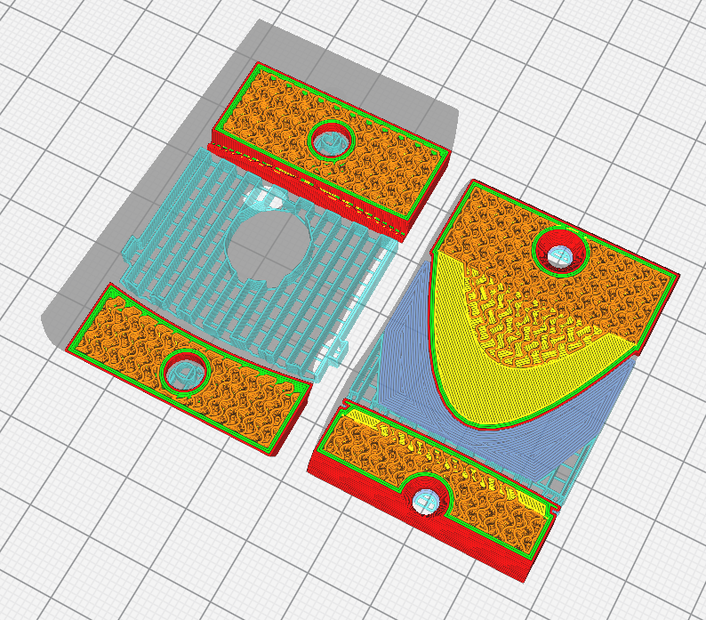
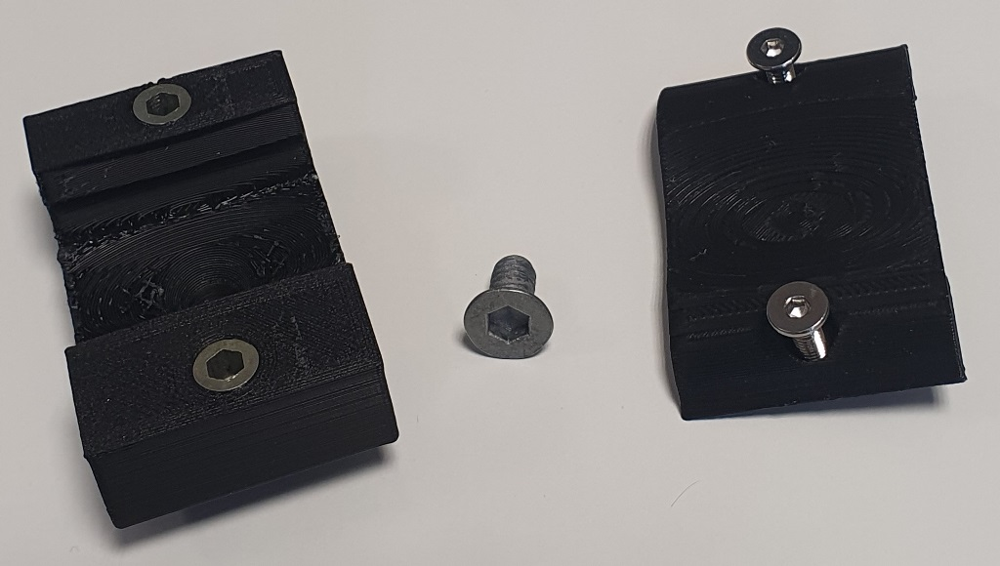
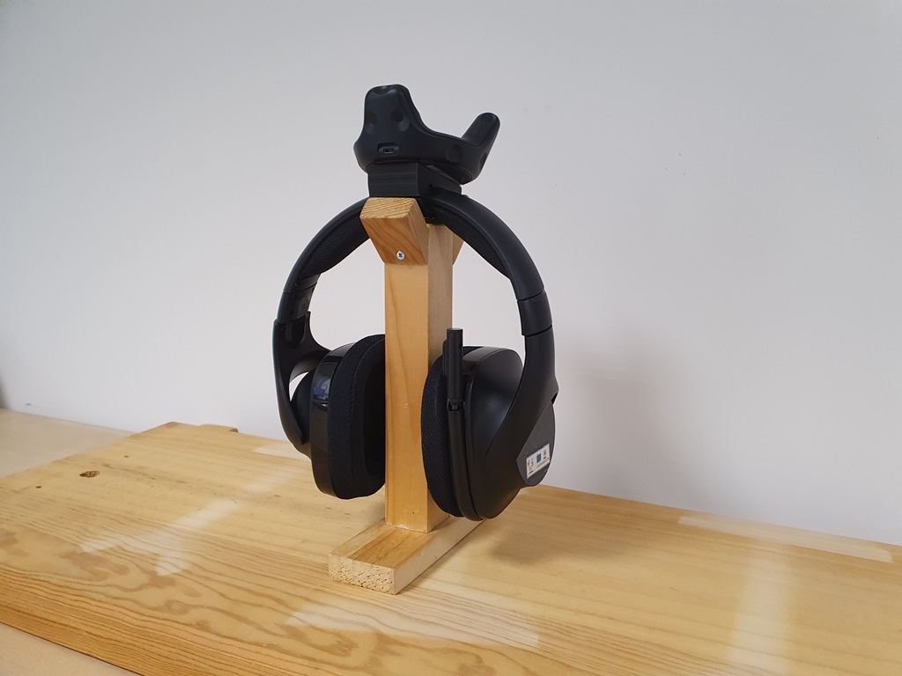

# Vive Tracker mount for headset

For attaching a Vive Tracker onto a [Logitech G533 wireless headset](https://www.logitechg.com/fr-be/products/gaming-audio/g533-wireless-gaming-headset.981-000634.html).

Model based on [HTC VIVE Tracker 5cm Band Adapter](https://www.thingiverse.com/thing:2706598) by [Taiwoo Park](https://www.thingiverse.com/teriousp/designs)
licensed under the Creative Commons - Attribution license. 

### Printing information
On [Cura](https://ultimaker.com/software), rotate the model to present the interface on the bottom, then click on *Rotate* -> *Lay flat*. You should get this placement :  

- Material : PLA
- Layer height : 0.2 mm
- Infill : 35% infill, Gyroid
- Support : 
    - Enable : Yes
    - Overhang angle : 60°
    - Z distance : 0.2 mm
    - X/Y distance : 1.2 mm
- Build plate adhesion : None

### Mounting
You will need a 12 mm long countersunk screw for screwing into the tracker 1/4" insert,
two [M4 inserts nuts](https://en.wikipedia.org/wiki/Insert_nut) and two 16 mm long M4 screws to fasten the two pieces together.

And once mounted : 

